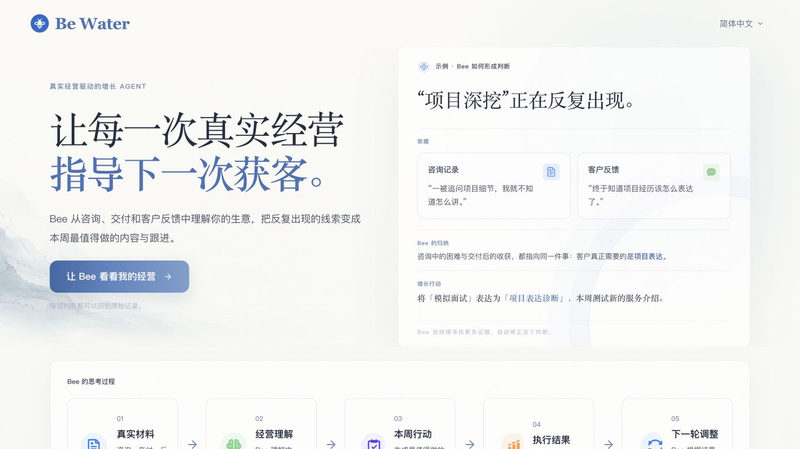
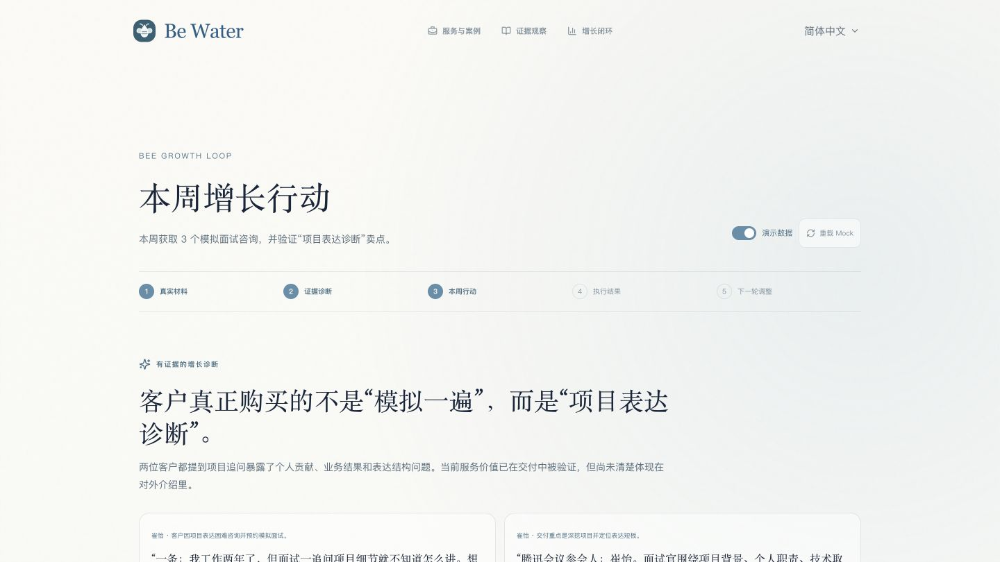
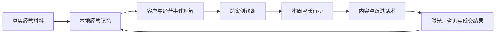
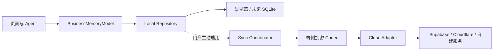

<div align="center">
  <h1>BeWater</h1>

  <p><strong>真实经营驱动的 AI 增长搭档</strong></p>
  <p>让每一次真实经营，指导下一次获客。</p>

  <p>
    <a href="http://c76e384e3a027f8f0c7a972e85e3e237.makers-preview.qcdntest.net/">在线体验</a>
    ·
    <a href="https://www.bilibili.com/video/BV13G3j6bEzC/">演示视频</a>
    ·
    <a href="submission/方案说明文档.md">方案说明</a>
  </p>
</div>

## BeWater 是什么？

BeWater 是一套基于 WorkBuddy，面向个人销售、自由职业者与小型专业服务团队的 AI 经营增长搭档。

它不从 Prompt 开始，而从真实经营开始。咨询聊天、报价预约、会议记录、交付材料、客户反馈与成交结果，会持续沉淀为用户拥有的经营记忆。Bee 基于这些真实经营事实理解业务、形成经营判断，并生成下一步最值得执行的增长行动。

> 个人销售者和小团队并不缺少一个会写营销文案的 AI。他们缺少的是一套能够理解真实客户、记住经营过程、发现已验证价值，并把判断转化为行动的系统。

## Demo

| 经营记忆首页 | 增长行动闭环 |
| --- | --- |
|  |  |

- [在线 Demo](http://c76e384e3a027f8f0c7a972e85e3e237.makers-preview.qcdntest.net/)
- [Bilibili 演示视频](https://www.bilibili.com/video/BV13G3j6bEzC/)

Demo 以“模拟面试”个人服务为例，展示从客户咨询、交付和反馈中发现“项目表达诊断”这一真实购买价值，并将判断转化为闲鱼、小红书和微信回访行动的完整过程。

## 核心能力

### 从真实材料开始

直接粘贴咨询聊天、会议逐字稿、交付记录或客户反馈，无需预先整理字段或编写复杂 Prompt。

### 形成可追溯的经营记忆

Bee 将原始材料转换为客户、案例、Evidence、经营事件、Outcome 与多维案例状态。每项判断都能回到具体客户和原始记录。

### 跨案例发现重复信号

一次发生只是事实；多个独立案例出现相同信号后，Bee 才会将其提升为模式，并明确区分客户自述、可观察变化与独立验证结果。

### 生成少量、可执行的增长行动

Bee 优先回答：本周最值得做什么、为什么值得做、如何判断是否有效，并直接生成渠道素材、跟进话术、目标与成功指标。

### 让结果回到下一轮判断

用户可以记录曝光、咨询、预约、成交和收入。Bee 根据真实结果判断什么值得继续、哪个环节正在流失，以及下一轮最应该做什么。

## 工作原理



BeWater 使用统一的 `BusinessMemoryModel` 保存客户身份、服务、案例、Evidence、经营事件、Outcome、增长计划和执行结果。页面和 Agent 通过同一个 Repository 读写这份经营记忆，避免出现多套互不一致的数据源。

当前网页版本采用 local-first 架构：

- 经营记忆保存在当前浏览器的本地空间；
- 导入与导出使用开放的 JSON 记忆包；
- 模型调用只接收当前任务所需的上下文；
- 未配置云端模型时，材料整理会降级为本地规则；
- 当前版本不包含登录、云端存储或多设备同步。

### 为未来云同步预留的架构

当前没有启用云同步，但数据层已经将本地存储与同步协议分开：



未来接入云服务时遵循以下原则：

- 本地经营记忆仍是用户日常工作的默认数据源；
- 云同步默认关闭，由用户主动开启；
- 明文经营记忆在上传前经过独立加密边界；
- 云服务实现供应商无关的 `BusinessMemorySyncAdapter`，不会侵入页面和领域模型；
- 同步使用远端 revision 检测并发修改，冲突时要求明确选择，不静默覆盖；
- 模型配置和 API Key 不进入同步载荷。

## WorkBuddy Skill

仓库包含可独立使用的 BeWater Business Memory Skill：

```text
skills/bewater-business-memory/
├── SKILL.md
├── agents/openai.yaml
├── references/
│   ├── evidence-rules.md
│   └── output-model.md
└── scripts/prepare_records.py
```

该 Skill 用于将客户聊天、会议转写、交付记录、反馈和经营资料整理为有证据支持的经营记忆。它强调：

- 原始材料与结构化结论分离；
- 每项事实和判断保留稳定来源引用；
- 商业、交付、付款和结果状态独立更新；
- 单一案例不被误写成普遍模式；
- 不确定结论交由用户确认。

## 快速开始

### 环境要求

- Node.js ≥ 22.13
- pnpm 10.x

### 本地运行

```bash
git clone https://github.com/TeresaPeng-zju/be-water.git
cd be-water
pnpm install
cp .env.example .env.local
pnpm dev
```

打开 <http://localhost:3000>。

### 可选：连接 DeepSeek

不配置 API Key 时，项目仍可运行，并使用本地规则完成基础材料整理。如需启用模型抽取，在 `.env.local` 中设置：

```bash
DEEPSEEK_API_KEY=your_api_key
DEEPSEEK_BASE_URL=https://api.deepseek.com
DEEPSEEK_EXTRACTION_MODEL=deepseek-v4-flash
```

API Key 仅由服务端读取，不会写入经营记忆或导出的记忆包。

## 常用命令

```bash
pnpm dev        # 启动开发服务器
pnpm lint       # 运行 ESLint
pnpm build      # 生产构建与类型检查
pnpm start      # 启动生产服务器
```

## 技术栈

- Next.js 15
- React 19
- TypeScript
- Tailwind CSS
- next-intl
- Zod
- 浏览器本地经营记忆 Repository
- WorkBuddy Skill
- 可选 DeepSeek 结构化抽取

## 项目结构

```text
app/                         Next.js 页面与 API
components/                  产品界面与交互组件
lib/
├── ai/                      材料理解、经营观察与检索
├── domain/                  经营领域模型
├── memory/                  本地记忆、导入导出与 Repository
│   └── sync.ts              未来加密云同步协议与冲突协调器
└── prototype/               统一 BusinessMemoryModel 与增长闭环
skills/bewater-business-memory/
                             WorkBuddy 经营记忆 Skill
submission/                  方案说明、截图与参赛材料
```

## 数据与隐私边界

BeWater 当前采用纯本地经营记忆：原始材料、案例、证据和历史判断默认保存在用户当前浏览器中。请注意：

- 清除浏览器站点数据会删除本地经营记忆；
- 建议定期在“记忆设置”中导出 JSON 备份；
- 当前版本没有云端备份或团队同步；
- 如果配置外部模型，完成任务所需的文本会发送到对应模型服务商；
- 请在导入真实客户资料前确认你有权处理这些资料。

## 当前状态

BeWater 目前处于可交互原型阶段，已经实现：

- 服务、客户、案例和 Evidence 的统一经营记忆；
- 咨询、交付、反馈等材料的结构化理解；
- 客户身份合并建议与多维案例状态；
- 跨案例经营观察与证据回溯；
- 增长行动、渠道素材、指标记录和结果复盘；
- 本地记忆导入与导出；
- 中文、繁体中文和英文界面。

后续方向包括本地文件与全文检索、更完善的模型适配、敏感字段脱敏，以及基于现有 sync contract 实现的端到端加密同步、团队空间和开放经营记忆 Schema。

## 参与共建

欢迎提交 Issue、改进建议或 Pull Request。特别期待以下方向的共建：

- 新经营材料导入器
- 本地模型与 OpenAI-compatible 模型适配
- Evidence 与身份归一能力
- 更多专业服务行业模板
- 增长实验与结果验证
- 桌面端本地数据库
