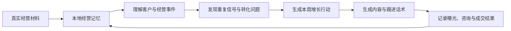
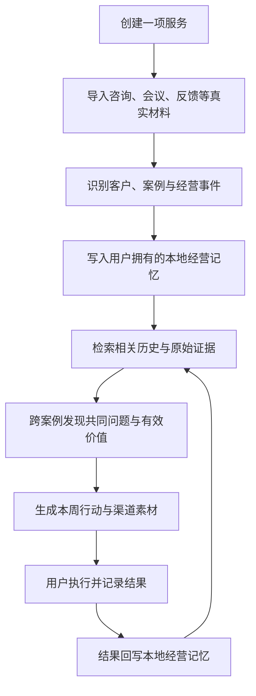
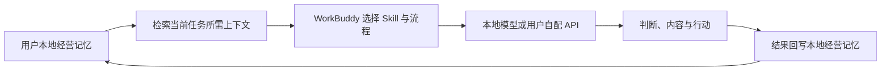
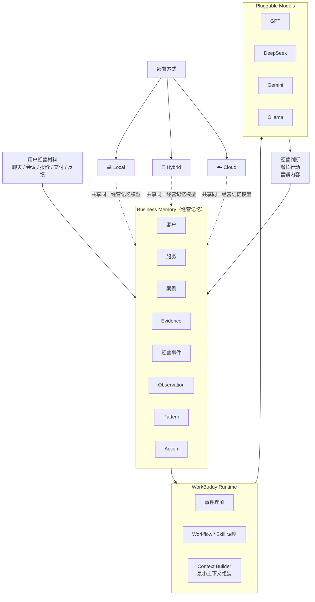
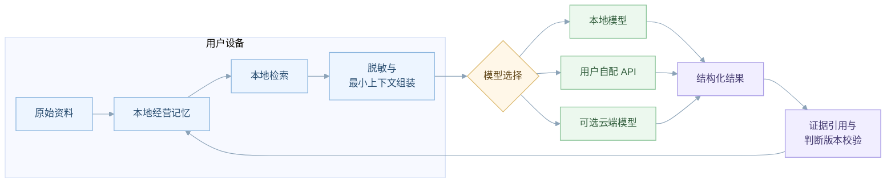

# BeWater：真实经营驱动的 AI 增长搭档

## 0. Demo 体验

**Demo 地址：**

<http://c76e384e3a027f8f0c7a972e85e3e237.makers-preview.qcdntest.net/>

**一句话定位：** BeWater 是一套基于 WorkBuddy 的 AI 经营增长搭档，让真实经营持续沉淀为经营记忆，并驱动下一轮增长。

**演示视频：**

[微信微盘](https://drive.weixin.qq.com/s?k=AJEAIQdfAAoNPMJj6IAZoADwZ-ADE)

如微盘不够清晰，可查看 [Bilibili 演示视频](https://www.bilibili.com/video/BV13G3j6bEzC/)。

**GitHub：**

<https://github.com/TeresaPeng-zju/be-water>

感兴趣也欢迎来共建！👋

## 1. 项目简介

BeWater 是一套基于 WorkBuddy，面向个人销售、自由职业者与小型专业服务团队的 AI 经营增长搭档。

它不从 Prompt 开始，而从真实经营开始。咨询聊天、报价预约、会议记录、交付材料、客户反馈和成交结果，会持续沉淀为用户拥有的经营记忆。

Bee 基于这些真实经营事实理解业务，形成经营判断，并生成下一步最值得执行的增长行动。

**让每一次真实经营，指导下一次获客。**

BeWater 提供云端、混合部署与本地部署三种模式，用户可根据隐私需求和使用场景自由选择。默认云端模式帮助个人和团队快速开始使用；混合部署兼顾智能能力与敏感数据保护；本地部署则适用于高隐私和离线场景。无论采用哪种模式，经营记忆始终属于用户。原始资料、结构化经营记忆和历史判断都可以迁移，不会因为更换模型、部署方式或平台而丢失。模型只是可替换的推理能力，按需读取完成当前任务所需的最小上下文，让用户始终拥有对自身经营资产的控制权。

## 2. 想解决的问题

个人销售者和小团队并不缺少营销工具，他们真正缺少的是一套能够理解真实业务、持续积累经验，并把经验转化为下一步行动的系统。

现有营销 AI 通常要求用户先描述自己的产品、目标客户和核心卖点，再生成客户画像、营销文案或跟进话术。但对于很多个人服务者来说，最难的问题恰恰是：他们自己也不完全清楚客户为什么购买。

此外，传统 CRM 更适合流程成熟、角色明确的销售团队。它要求使用者提前设计字段、阶段、漏斗和自动化规则。对于自由职业者与小型团队，这种维护成本往往高于实际收益。他们更需要的是：直接交给 AI 一段真实记录，由 AI 判断发生了什么、与哪个客户有关、当前处于什么阶段，以及下一步应该做什么。

要让 AI 真正理解一门生意，就必须长期接触客户身份、报价、会议逐字稿、交付文档、反馈和成交结果。这些信息越真实，对经营判断越有价值，同时也越敏感。如果所有材料都默认上传到平台服务器，用户很难放心建立长期记忆；如果用户不愿意提供真实材料，AI 又只能继续基于模糊描述生成通用建议。

因此，BeWater 不仅要解决“AI 如何记得更多”，还需要解决经营记忆由谁拥有，以及每次模型调用实际读取了什么。它不把“生成更多营销内容”作为起点，而是先回答：

> 哪些客户问题和服务价值，已经在真实经营中被验证？

BeWater 希望回答的不是“应该怎么营销”，而是“你的业务已经证明了什么，下一步最值得做什么”。

## 3. 竞品分析

我们对比了自由职业者经营管理（Moxie）、客户流程管理（HoneyBook / Dubsado）、预约排班（有赞）、知识店铺（小鹅通）等主流工具，发现一个共同的市场空位：**它们都在“把业务管起来”，但没有一款工具在“从真实经营中发现问题、沉淀经验、放大价值”。**这也正是 BeWater 的差异化定位。

相比之下：

- 常见 AI 营销产品通常从“请描述你的产品”开始，BeWater 从真实咨询、交付和客户反馈开始。
- 常见工具主要生成客户画像和营销文案，BeWater 会先判断哪些客户问题、购买动机和服务价值已经被真实案例验证，再决定本周最值得做什么。
- 常见工具在内容生成后结束，BeWater 会继续记录曝光、咨询、预约和成交结果，并用这些结果调整下一轮行动。
- 常见工具将获客和交付分开，BeWater 会把客户在真实服务中认可的价值重新带回服务定位、内容选题和销售表达。
- 常见工具很难解释为什么得出某个结论，BeWater 的每项判断都可以回到具体客户和原始记录。

因此，BeWater 并不是一个“带 AI 的 CRM”，也不是一个营销内容生成工具，而是一套以真实经营记忆驱动增长的经营系统。

## 4. BeWater 的解决方案

BeWater 建立了一条从真实经营材料到营销执行，再到结果复盘的持续增长闭环。

整个过程遵循：

1. 用户可以直接粘贴咨询聊天、会议逐字稿、报价信息、交付材料、客户反馈和营销结果，不需要提前整理格式，也不需要先写总结。
2. Bee 会先判断材料类型，再识别它属于哪个客户、哪项服务和哪个案例。例如，同一个客户可能在微信中叫“一条”，在腾讯会议中显示为“崔怡”。Bee 会结合预约时间、会议链接、简历和上下文提出身份合并建议，避免把同一个客户重复识别为两个人。
3. 完成身份识别后，Bee 会将材料转换为可追溯的经营事件，例如“客户主动咨询”“预约成功”“服务已交付”“待发送会后材料”“收到客户反馈”。这些事件会持续更新案例状态，而不是只留下一个脱离业务过程的聊天摘要。
4. 当多个独立案例出现相似信号时，Bee 会形成更高层的经营判断。例如，多位模拟面试客户都在咨询中提到“被追问项目后不知道怎么讲”，交付后的反馈又反复提到“项目深挖”和“明确表达方向”，Bee 才会提出：

   > 客户真正购买的并不只是一次模拟面试，而是项目表达诊断。

5. 每项判断都可以回到原始记录。用户能够查看 Bee 引用了哪些咨询、交付和反馈，也可以在后续证据出现后修正旧结论。
6. 判断形成后，Bee 不会生成十几条泛泛建议，而是收敛为少量、明确、可衡量的本周行动。例如优化闲鱼服务页、发布一篇小红书内容、回访已有客户，并直接生成对应的文案、执行目标和成功指标。
7. 用户执行后，可以继续记录曝光、咨询、预约、成交和收入。Bee 再根据结果判断什么值得继续、哪个环节正在流失，以及下一轮最应该做什么。

## 5. 核心产品流程

BeWater 的产品体验围绕一句原则展开：

> **Bee 负责组织事实，用户负责经营业务。**

在服务页中，用户可以看到完整的客户案例时间线。咨询、预约、交付、反馈和后续跟进不再是互相割裂的聊天记录，而是同一经营过程中的不同阶段。

在经营笔记中，Bee 会保存由真实案例形成的经营观察、跨案例模式和增长行动。一次事件只是一条事实，多个不同客户出现相同信号后，才会形成模式。新的证据出现时，旧判断可以被修正，而不是永久固化。

在增长行动中，Bee 会优先回答三个问题：本周最值得做什么、为什么值得做，以及如何判断是否有效。内容生成只是最后一步，而不是产品的全部。

这些资料和结构化结果都会沉淀到本地经营记忆中。外部模型不是长期数据的唯一保存位置，即使用户更换模型，已经积累的客户、案例、证据和历史判断仍然属于用户自己。

## 6. 为什么选择 WorkBuddy

WorkBuddy 负责 Bee 的智能编排，本地经营记忆负责保存用户长期拥有的业务上下文。二者的分工是：数据和历史留在用户侧，WorkBuddy 根据当前经营事件选择合适能力，并调取完成任务所需的最小上下文。Bee 基于 WorkBuddy 的 AI 能力、流程编排能力和智能体能力完成经营事件理解、Skill 调度与增长闭环。

WorkBuddy 可以在统一上下文中连接客户、服务、案例、原始材料、历史判断和执行结果。用户不需要每次重新说明自己的业务背景，Bee 可以基于长期积累持续工作。

WorkBuddy 还能够根据不同经营事件调用不同能力。咨询聊天进入咨询理解流程，会议逐字稿进入交付分析流程，客户反馈进入 Outcome 提取流程，执行数据进入增长复盘流程。不同处理结果最终汇总到同一份本地经营记忆中。

在此基础上，WorkBuddy 可以串联从理解、判断到执行的完整流程。Bee 不仅分析历史记录，也能够继续生成增长行动、渠道内容和跟进话术，并在用户记录结果后重新复盘。

因此，WorkBuddy 不是经营资料的黑盒仓库，而是连接本地经营记忆、AI 能力与业务动作的智能编排层。

## 7. 技术方案

BeWater 采用事件驱动架构，将用户可控的经营记忆、WorkBuddy 智能编排与可替换模型能力结合起来，并支持云端、混合与本地三种部署模式。

### 7.1 经营记忆与 WorkBuddy 协同架构

原始经营材料和结构化经营记忆优先保存在用户设备中。客户身份、服务、案例、Evidence、经营事件、经营判断、行动和执行结果不会停留在一次模型对话中，而会持续沉淀为可追溯、可复用的经营记忆。

模型调用前，系统会先从本地经营记忆中检索当前任务所需的客户、案例、经营事件和原始 Evidence，再组装任务所需的最小上下文。这意味着模型只负责当前任务的推理，而不需要读取用户完整的经营资料库。

模型能力与经营记忆相互独立。经营记忆负责长期保存业务上下文，模型负责理解、分析和生成结果。不同模型可以完成同样的推理任务，而不会影响已经积累的客户、案例和经营历史。

新增材料不会统一进入一个“请总结这段内容”的 Prompt。系统会先识别材料类型，再分别进入咨询理解、交付分析、Outcome 提取和增长复盘等处理流程，不同处理结果最终汇总到同一份本地经营记忆中。

当前阶段主要通过关系数据和精确查询获取业务上下文。客户是否付款、案例是否完成交付、服务成交次数等事实由结构化数据维护，而不是依赖向量相似度判断。

### 7.2 材料处理与模型调用流程

一份新材料进入 BeWater 后，会经过五个明确的处理阶段：

- **类型识别：**判断材料是咨询聊天、会议逐字稿、交付文档还是客户反馈，路由到对应的处理流程；
- **身份归一：**结合预约时间、会议链接和上下文，将“微信里的一条”和“腾讯会议里的崔怡”合并为同一客户，合并动作由用户确认；
- **事件抽取：**将材料转换为结构化经营事件（客户主动咨询 / 预约成功 / 服务已交付 / 收到反馈），每个事件携带 Evidence 引用，回链到原始材料的具体段落；
- **最小上下文组装：**模型调用前，系统先用关系查询取出当前任务所需的客户、案例和事件（而非整库），组装成最小 Prompt 上下文；
- **判断沉淀：**模型输出的经营判断带版本号写回本地记忆，新证据出现时生成新版本，而不是覆盖旧结论。

Evidence 引用、业务元数据和判断版本共同构成可追溯的经营记忆，为跨案例归纳和结果复盘提供可靠的数据基础。

## 8. 用户价值

BeWater 希望帮助个人销售者和小团队减少重复整理、持续积累经营经验，并让营销从一次性的内容生成，变成可以持续学习和优化的增长过程。

**对于个人销售者，**BeWater 能减少整理客户记录和准备营销内容的时间，降低跟进遗漏，并直接提供本周最值得执行的获客行动。

在模拟面试 Demo 场景中：

- 一次约 **2000 字咨询对话**的整理，从人工约 **15 分钟**降低至约 **30 秒**；
- 一周三个渠道（闲鱼、小红书、微信回访）的营销素材生成，从约 **2 小时**缩短至 **3 分钟**；
- 客户跟进统一进入本周行动清单，预计将原本约 **30%** 的跟进遗漏降至接近 **0**。

**对于自由职业者和专业服务者，**BeWater 能从真实交付和客户反馈中识别最被认可的价值，帮助用户优化服务定位、报价表达和对外内容，并逐步将个人经验沉淀为案例、模板和 SOP。

**对于小型团队，**BeWater 可以统一客户、案例和营销上下文，减少成员之间的信息断层，让销售、交付和运营围绕同一份经营记忆协作。

**对于需要处理客户聊天、报价和交付文件等敏感资料的用户，**本地化经营记忆还能降低长期使用 AI 的信任门槛。用户不需要在“让 AI 更懂业务”和“保护真实客户资料”之间二选一，也不会因为更换模型而失去已经积累的经营历史。

## 9. 未来规划

未来，BeWater 将围绕本地经营记忆、模型能力和 Agent 自动化三个方向持续演进。

### 第一阶段：完善本地经营记忆

进一步完善本地工作区能力，包括本地数据持久化、客户身份归一、Evidence 管理、经营事件、案例状态和判断版本，并支持文件管理、全文检索、数据导出与迁移，让用户真正拥有完整、可持续积累的经营历史。

### 第二阶段：增强模型能力与隐私控制

支持本地模型、用户自配 API 以及更多模型适配能力，并增加模型调用内容预览、最小上下文组装和敏感字段自动脱敏，让用户能够更灵活地平衡隐私、成本与效果。

### 第三阶段：扩展营销执行能力

支持更多内容渠道、跟进提醒、日历任务等经营动作，并结合本地关系查询与全文检索，在数据规模增长后逐步引入向量检索，用于发现跨案例模式和长期经营趋势。

### 第四阶段：开放经营生态

探索默认关闭的加密同步、团队空间和自动备份，并逐步开放经营记忆 Schema、导入器、模型适配器和分析 Skill，让第三方能够围绕经营记忆扩展新的能力。

### 长期目标

最终，Bee 将成长为真正的经营 Agent：主动感知新增经营事件，根据当前业务状态判断下一步，调用不同 Skill 完成分析与执行，并依据新的经营结果持续修正长期经营判断。

## 10. 总结

个人销售者和小团队并不缺少一个会写营销文案的 AI。他们真正缺少的是一套能够理解真实客户、记住经营过程、找出已经被验证的价值，并把这些判断转化为下一步行动的系统。

BeWater 基于 WorkBuddy，将咨询、报价、交付、客户反馈和营销结果连接成一份由用户拥有的本地经营记忆。WorkBuddy 负责理解事件、调度能力和推动行动，模型可以被替换，但用户积累的客户、案例、证据和经营经验始终掌握在自己手中。

Bee 不只告诉用户过去发生了什么，也会基于真实证据判断下一步应该争取什么客户、表达什么价值、发布什么内容，以及如何验证结果。

**让每一次真实经营，指导下一次获客。**

**让经营经验沉淀为资产，让 AI 真正理解你的业务。**

感谢阅读！❤️
